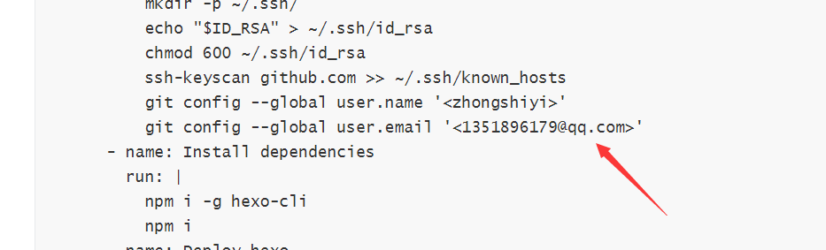

# GitHub Actions 自动部署 Hexo 博客教程

# 前言

上一篇 Github + Hexo 搭建个人博客详细教程中，我们已经搭建好了属于自己的博客，但是博客和文章的源文件都在我们本地，如果丢失就很麻烦，所以现在我们引用 Github Actions
来自动部署我们提交到仓库的博客源文件。这样我们每次在本地写好博客，就可以直接 `git add .`, `git commit -m`, `git push` 三连。就会自动生成 Hexo 博客。以后就不用每次写完文章之后再执行 hexo clean && hexo g -d 了。

## 新建仓库

+ 创建一个新的仓库来存放我们的博客源文件，名字随便起就行。

## 仓库配置

进入 **settings** 页面，在 **Secrets** 处添加环境变量。


点击 **Add a new secret**，Name 设定为 **id_rsa**，Value 填上你的私钥。如果你不知道你的私钥是什么，请看上一篇 [GitHub + Hexo 搭建个人博客详细教程](https://zhongshiyi.github.io/2019/12/29/github-hexo-da-jian-ge-ren-bo-ke-xiang-xi-jiao-cheng/)


## 配置工作流

进入仓库的 Actions 界面，点击 `New workflow` 按钮


在项目的根目录新建 .github/workflows/nodejs.yml 文件


输入以下内容并保存。

```
name: Node CI

on: [push]

jobs:
  build:

    runs-on: ubuntu-latest
    
    strategy:
      matrix:
        node-version: [10.x]
    steps:
      - uses: actions/checkout@v1
      - name: Use Node.js ${{ matrix.node-version }}
        uses: actions/setup-node@v1
        with:
          node-version: ${{ matrix.node-version }}
      - name: Configuration environment
        env:
          ID_RSA: ${{secrets.id_rsa}}
        run: |
          mkdir -p ~/.ssh/
          echo "$ID_RSA" > ~/.ssh/id_rsa
          chmod 600 ~/.ssh/id_rsa
          ssh-keyscan github.com >> ~/.ssh/known_hosts
          git config --global user.name '<zhongshiyi>'
          git config --global user.email '<1351896179@qq.com>'
      - name: Install dependencies
        run: |
          npm i -g hexo-cli
          npm i
      - name: Deploy hexo
        run: |
          hexo g -d

```



这里填你的 **GitHub 用户名**和**邮箱**

然后就完成了 Hexo 博客自动部署的脚本了，之后写博客就可以直接 `git add`, `git commit`, `git push` 三连，等它两到三分钟就能部署完成在你的博客网站上了。

参考文章：

[使用 GitHub Actions 自动化部署 Hexo](teaching.applysquare.com)